# Tween UX audit

> Every step transition, forwards and backwards, read frame by frame against
> `notes/design/motion.md` on 2026-09-19, at commit `fed6737` plus the two
> uncommitted edits in the working tree at the time (the credits block order
> in `Index.svelte` and the `raceClose` title in `race.js`; neither alters a
> tween). This is a record of where the motion falls short of its own rules,
> with a frame for every claim. It does not sign anything off: the checklist
> (`notes/tween-checklist.md`) stays Owen's.

## How to read this

**What was run.** Three passes over all 29 adjacent pairs in both directions,
on the mobile box (375×667) and the desktop box (1280×800):

| Pass           | What                                                                                                                                               | Runs |
| -------------- | -------------------------------------------------------------------------------------------------------------------------------------------------- | ---- |
| Arrival        | `npm run sheet`, 1.6 s window, 12 frames                                                                                                           | 114  |
| Long           | `npm run sheet`, 6 s window, 16 frames, plus a settled frame                                                                                       | 114  |
| Real clock     | a plain browser, no faked clock, dense frames for 1.6 s then a rest frame every second to 10 s, with a per-frame log of every visible text element | 114  |
| Reduced motion | the real-clock capture under `prefers-reduced-motion: reduce`                                                                                      | 57   |
| Interruption   | Next pressed twice 300 ms apart, from every step                                                                                                   | 28   |

The four gated steps were left by their own control, and the four backward
moves that pass through a `skipback` step were captured as such. The quiz gate
(20→21 forwards) is left by answering it: the harness clicks a card, waits out
the 900 ms flight and 450 ms hold, and repeats until the panel has nothing
left to ask, so that arrival is captured the way a reader reaches it. The two
long pans (11→12, 12→11) were re-run with a 12 s window in 24 frames.

**Why three passes.** The first pass judged a 1.6 s window on a faked clock and
missed two things Owen saw by eye: what a step does once it has settled, and
text moving at the press. The long pass watches each entry to its end and each
step at rest; the real-clock pass gets the HTML timing right and logs the
position, opacity and text of every visible element on every frame, so pops,
jumps, side changes and text swaps are found by measurement rather than by
looking.

**Against what.** All three passes drove a static production build
(`npm run build`, served from outside the repo). A vite dev server in this
repo shares `.svelte-kit/` with every other server or build in the same
checkout, and each regeneration reloads the page under the harness and
swallows the press.

**Two clocks.** The sheet's canvas timings are exact; its HTML timings are
late by up to one frame interval, and a fade that starts after the window is
shown near its start in the settled frame. Every claim below about a name, an
axis, a panel or the prose is from the real-clock pass. Where the two
disagreed the real clock won, and three findings the sheets suggested turned
out to be artefacts; they are recorded under Tooling.

**Where the evidence is.** Each finding embeds a strip from `notes/audit/`,
cut from `sheets/audit/` (gitignored; the commands above regenerate it). Δ is
the share of pixels changed since the previous frame. Times in a caption
marked "real" are milliseconds after the press on a real clock.

**Severity.** High: the reader loses the step's subject, or a mark pops at
full opacity. Medium: visible on every reading, subject survives. Low: polish.

## What is already right

- **Reduced motion passes everywhere.** All 57 mobile moves land on their
  settled frame at once: nothing changes after the first 120 ms, no travel, no
  choreography, no leg to wait out. Rule 13 had not been checked before this pass.
- **Interruption is safe.** All 28 double-press runs retarget from the live
  frame, land where the gates dictate, and leave nothing behind except the
  edges in finding 9. Rule 8 holds.
- **The prose swap itself is exact**: out over 200 ms, about 100 ms of blank
  card, in over 260 ms, symmetric in both boxes and both directions.
- **Names are never cut.** Across 114 real-clock runs not one name leaves at
  full opacity; every one fades.
- **2→3** is the one departure that does rule 2 in full: the edges fade
  between 145 and 580 ms with not one dot moving until after 725 ms.
- **25→24** and **24→23** fade the career lines where they stand, hold, then
  bring the names in. **29→28** brings the closing chart back as one tween.
- **0→1**'s four legs land where `title-card.md` says; the sky leaves by a
  300 ms fade with no pop, and the walk's end is silent and pixel-identical to
  step 1 reached backwards. **9→10**'s rewind holds a constant 3 years per
  second in both boxes.
- **22→21** and **23→21** are pixel-identical, as a skip-through should be.
- **Nothing runs after landing** on steps 15 to 20: every rest frame to ten
  seconds is Δ 0.00.
- Checklist row 26's note ("dots tween towards top left") is refuted for the
  six contenders: they land on the origin. It is the departing crowd that
  sweeps off the top (finding 12).

## Triage

One box per row. `[x]` marks the choice; leave a row blank to come back to it.
Findings are numbered in the sections below.

| #   | Finding                                                                                  | Sev    | Fix  | By design | Don't care |
| --- | ---------------------------------------------------------------------------------------- | ------ | ---- | --------- | ---------- |
| 1   | The furniture layer's beat is inverted: cut out at the press, faded in during the travel | high   | [x ] | [ ]       | [ ]        |
| 2   | Chart lines morph between shapes instead of fading                                       | high   | [x ] | [ ]       | [ ]        |
| 3   | The quiz panel pops in and out at full opacity                                           | high   | [x ] | [ ]       | [ ]        |
| 4   | Label text is swapped in place with no fade                                              | high   | [x ] | [ ]       | [ ]        |
| 5   | Step 10 rests on 2025 unless the reader came through the rewind                          | high   | [x ] | [ ]       | [ ]        |
| 6   | On the beside layout the outgoing prose jumps columns at the press                       | high   | [x ] | [ ]       | [ ]        |
| 7   | On the phone a chapter card re-deals the whole sky, stops dead, then starts it again     | high   | [x ] | [ ]       | [ ]        |
| 8   | Everything chained after an arrival waits out the edge lag                               | medium | [x ] | [ ]       | [ ]        |
| 9   | Departing edges ride their dots                                                          | medium | [x ] | [ ]       | [ ]        |
| 10  | The rank ladder lands on the dissolving chart, then loses rows                           | medium | [x ] | [ ]       | [ ]        |
| 11  | Names travel with dots in flight                                                         | medium | [x ] | [ ]       | [ ]        |
| 12  | The crowd sweeps off the canvas, and through the next chart                              | medium | [x ] | [ ]       | [ ]        |
| 13  | Step 22 draws the resting camera, then snaps to the pan's start                          | medium | [x ] | [ ]       | [ ]        |
| 14  | Stepping into and out of the future strip costs nine to ten seconds                      | medium | [x ] | [ ]       | [ ]        |
| 15  | The scrubber reads 2006 for ten seconds while the chart pans from 2025                   | medium | [x ] | [ ]       | [ ]        |
| 16  | The prose settles before the canvas does                                                 | medium | [x ] | [ ]       | [ ]        |
| 17  | Deep links land on states the story never shows                                          | medium | [x ] | [ ]       | [ ]        |
| 18  | On the phone the quiz's dim covers the step's own question                               | medium | [x ] | [ ]       | [ ]        |
| 19  | The 8→9 draw-on is dead, then sub-perceptual, then pops a name                           | medium | [x ] | [ ]       | [ ]        |
| 20  | The closing chart's draw is 3.6 seconds and its names re-sort four times                 | medium | [x ] | [ ]       | [ ]        |
| 21  | Phone-width statics                                                                      | medium | [x ] | [ ]       | [ ]        |
| 22  | The actor tour starts on a timer and wipes the names it just brought in                  | low    | [x ] | [ ]       | [ ]        |
| 23  | The title card's first highlight beat lands with the title                               | low    | [x ] | [ ]       | [ ]        |
| 24  | Step 3's constellation reads as stuck stars                                              | low    | [x ] | [ ]       | [ ]        |
| 25  | Pulse rings are the only non-sky motion at rest                                          | low    | [x ] | [ ]       | [ ]        |
| 26  | The dot bar arrives about 0.9 s before the prose                                         | low    | [x ] | [ ]       | [ ]        |
| 27  | The outro's six dots are alone for 1.6 s                                                 | low    | [x ] | [ ]       | [ ]        |
| 28  | The auto-advance steps re-enable their button for one frame                              | low    | [x ] | [ ]       | [ ]        |
| 29  | Bacon's dot is swapped for the rank row's glyph on 6→7                                   | low    | [x ] | [ ]       | [ ]        |
| 30  | The band arrival has two dead stretches                                                  | low    | [x ] | [ ]       | [ ]        |
| 31  | Route edges outlast the grey ones on 2→3                                                 | low    | [x ] | [ ]       | [ ]        |
| 32  | Motion on a timer after landing, collected for one decision                              | low    | [x ] | [ ]       | [ ]        |

Four rows are decisions rather than defects, and the document argues both
sides rather than assuming one: 14 (the ten-second pans), 24 (step 3's
constellation), 25 (the pulse rings) and 32 (the timer question). Finding 21
is seven separate phone collisions, so mark it up if you want only some.

## Findings

### High

#### 1. The furniture layer's beat is inverted: cut out at the press, faded in during the travel

Rules 2, 6, 7. The chart title, axis names, ticks, band labels, legend, the
takeover callout and the scrubber's year are not tweened but they are not
sequenced either, and both halves are backwards.

**Leaving is a cut.** On 52 of the 114 real-clock runs a piece of furniture is
at full opacity in one frame and absent from the document in the next, within
60 ms of the press. Tracing one element across the press on 25→26:

```
Film count by career age   -105ms:1  -88:1  -71:1  -55:1  -38:1  -23:1  -6:1  +12ms: gone
Wins after 10,000 sims     -105ms:gone ...  -6:gone  +12ms:0  31:0  50:0.03  71:0.07
                           93:0.14  115:0.31  138:0.41  162:0.58  188:0.65  ...
```

**Arriving is during the travel.** The incoming furniture starts its fade at
the press and reaches full ink at a median of 275 ms, while the dots are still
moving; they land between 440 and 1630 ms depending on the move. Over the 21
chart moves measured the furniture is complete 230 to 1360 ms before the dots
stop.

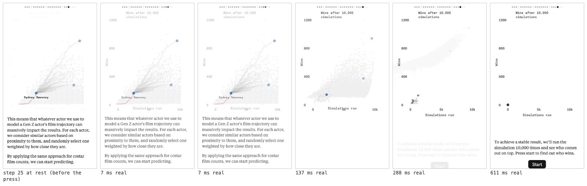

At 7 ms the career chart's title, axis labels and ticks are gone while its
dots and lines are untouched, and the simulation's furniture is already
fading in over them.

Moves: every chart-to-chart and chart-to-card move; the full list is 52 runs
covering 2→1, 2→3, 5→4, 7→6, 8→7, 9→8, 11→10, 11→12, 12→11, 12→13, 14→13,
18→19, 19→18, 19→20, 20→19, 22→21, 23→22, 23→24, 24→23, 24→25, 25→24, 25→26,
26→25, 27→26, 27→28, 28→27, 28→29 in both boxes.

Mechanism: the overlay is rendered from the step's state with no out
transition, so a state change destroys it; the `fade-in` class then animates
the replacement from the press. Rule 2 wants the opposite order and rule 6
wants a gap between them: fade the outgoing furniture out first, then travel,
then fade the incoming furniture in on `story.settled`, the gate `labelsAfter`
already gives the names.

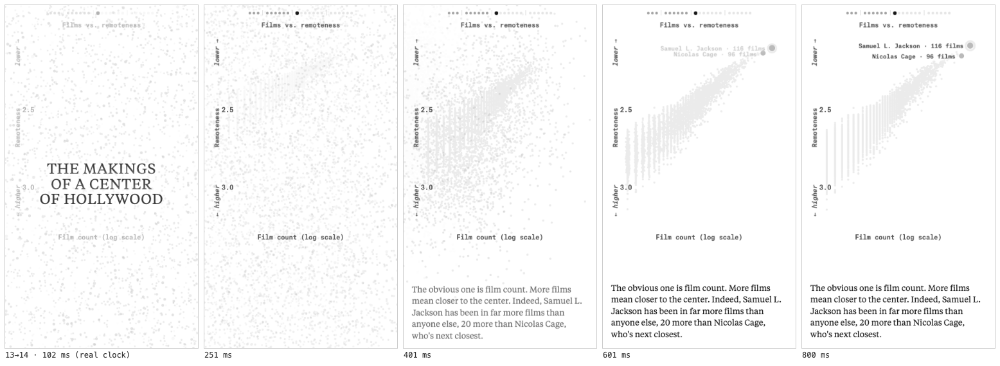

#### 2. Chart lines morph between shapes instead of fading

Rules 2, 6. A trail slot alive in both states is tweened vertex by vertex over
the whole 700 ms, so the reader sees a curve that exists in neither chart,
drawn to dots still in flight. On **28→27** the five projection lines and
SLJ's line bend into the simulation's win-count climbs, mid-shape at 435 and
580 ms, while the sim axes are already up. On **23→24** the Gen Z field is
pulled toward the departing dot column at 145 ms rather than dissolving where
it stood. Checklist rows 24 and 28 confirmed, and extended to the backward
arrival, which is worse because the projections start at full ink.

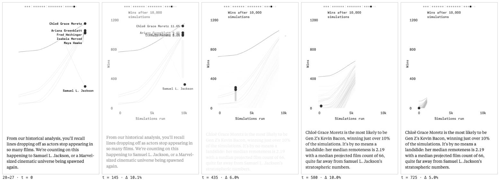

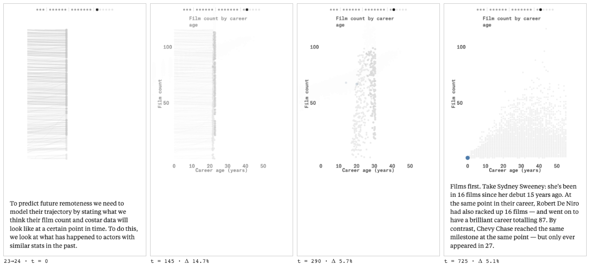

Mechanism: the 220 ms departure fade in `tweenTrails` applies only to slots
whose target alpha is 0. A slot that changes chart should fade out and
re-enter, unless a design note says the line is the same line.

#### 3. The quiz panel pops in and out at full opacity

Rules 6, 7. At 35 ms after the press on **19→20** the question and both
buttons are at full ink over a still-crisp step-19 scatter and the old prose;
the blur and dim follow. Backwards, **20→19**, the panel is gone in one frame.
The panel is rendered straight from the step config with no transition.

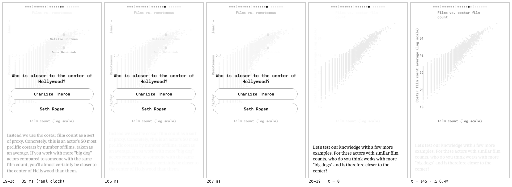

Mechanism: give the panel the chapter card's treatment, a stable `{#if}` with
a fade both ways, and hold the fade-in behind `story.settled`.

#### 4. Label text is swapped in place with no fade

Rules 2, 7. When a node keeps its label but the text changes, the string is
mutated at full opacity within one frame: "Natalie Portman · 2.23 remoteness"
becomes "· 97 of the top 250" on **16→17** at 35 ms real, and back on 17→16;
"· 57" on **18→19**; "Chloë Grace Moretz" gains "11.6%" on **28→27** while
three other labels pile on top of one another. On 16→17 that swap is the only
thing the step does. The real-clock log records 144 such swaps across the
story. The related recorded defect (checklist rows 14 and 15) is the departing
label losing its suffix before its name fades on **14→15** and **15→14**.

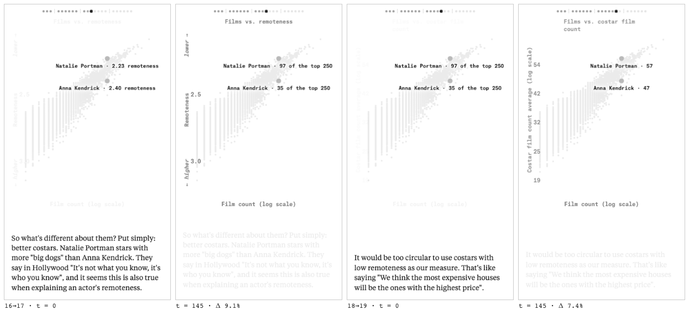

Mechanism: the framework's Known gap (`{#key}` label swaps drop the old label
instantly) extends to a `labelText` change on the same node. Treat a text
change as a label leaving and a label arriving; the 450 ms param tween has
room for both halves.

#### 5. Step 10 rests on 2025 unless the reader came through the rewind

Rule 3. Stepping back **11→10** lands on the 2023–2025 axis with SLJ at 2.09,
under the sentence "Let's go back to where Samuel L. Jackson took the crown in
2006". A cold `?step=10` shows the same. Only the rewind from step 9 reaches 2006.

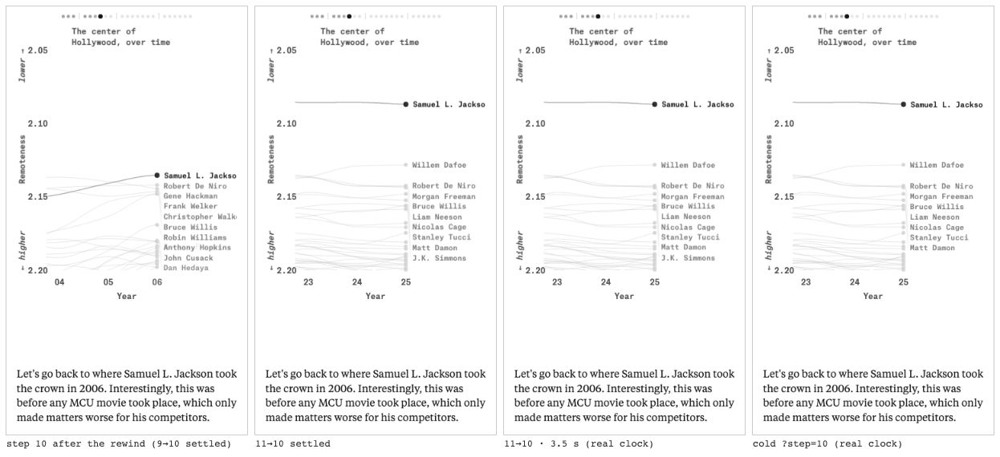

Mechanism: `interactions.md` says re-entering `raceRecent` resets the render
playhead to the present so the pan has its full travel. That is right for the
gated step 9 and wrong for 10. Scope the reset to the gate.

#### 6. On the beside layout the outgoing prose jumps columns at the press

Rules 2, 7. Above 1200 px the prose column swaps sides on every chapter card,
and the swap lands the instant the press does. The departing prose is inside
the column that moves, so on **3→4** the step 3 text jumps from x = 16 to
x = 864 at full opacity and then fades out on the wrong side over the next
200 ms; on **12→13** it jumps right to left, and the chart's names go with it,
about 290 px away from their dots. Backwards onto a card the incoming prose is
at opacity 0 when the column flips, so it fades in on the correct side. On the
phone there is no column to swap.

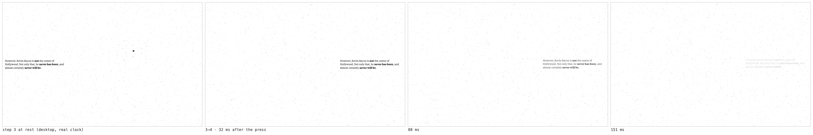

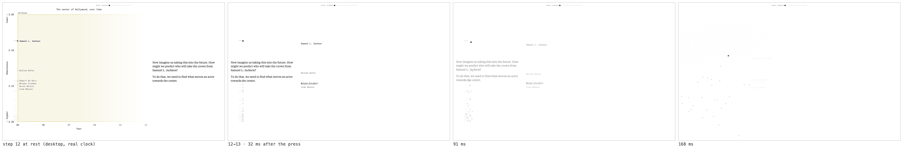

Mechanism: `flipped` in `Stage.svelte` derives from the current step; the
prose's 200 ms exit runs after it. Either the flip waits for the exit, or the
departing prose and names are pinned to their old side.

#### 7. On the phone a chapter card re-deals the whole sky, stops dead, then starts it again

Rules 9, 7, and it refutes "not one dot moves". Measured over a rolling 300 ms
window in a text-free band of the canvas, every mobile card arrival does the
same three things:

|                  | 3→4  | 4→3  | 12→13 | desktop (all three) |
| ---------------- | ---- | ---- | ----- | ------------------- |
| press to ~800 ms | 3.0% | 3.2% | 2.1%  | 0.8%                |
| 1000–1400 ms     | 0.0% | 0.0% | 0.0%  | 0.8%                |
| 1500 ms on       | 3.1% | 3.1% | 3.0%  | 0.8%                |

The crowd is moved for about 800 ms at the same visual rate the flow later
runs at, the canvas then holds perfectly still for 400 to 500 ms, and the sky
starts. On desktop the rate is flat throughout: the flow simply carries on and
there is no beginning to see.

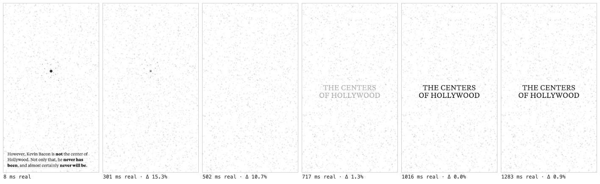

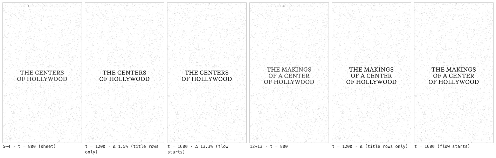

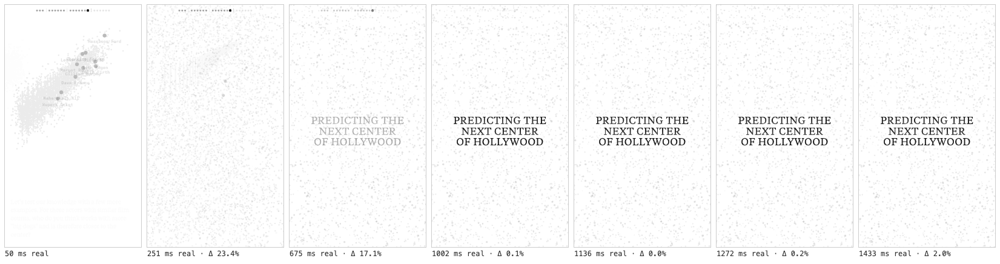

Mechanism: two faults on one move. The arriving galaxy layout is the flow at
t = 0, so the arrival tween carries every dot from its live flow position to a
different one instead of handing the flight through; and the ambient then
waits for the arrival's settle, which includes the 525 ms edge lag although no
edge is arriving. `departureColumn` already reads the live clock on the way
out; the arrival wants the same, and the flight wants to start when the dots
land.

### Medium

#### 8. Everything chained after an arrival waits out the edge lag

Rules 6, 10. On every step whose entry has a second leg, the dots land by
about 800 ms, the canvas then shows nothing for 400 to 600 ms, and the leg
starts between 1200 and 1600 ms: the step 22 pan, the trio draw on 23→24, the
fan on 24→25, the projections on 27→28, the outro pull-back on 28→29, the
2→3 pull-back, and the sky on every card arrival (finding 7). The reader gets
a finished still picture, then a second event.

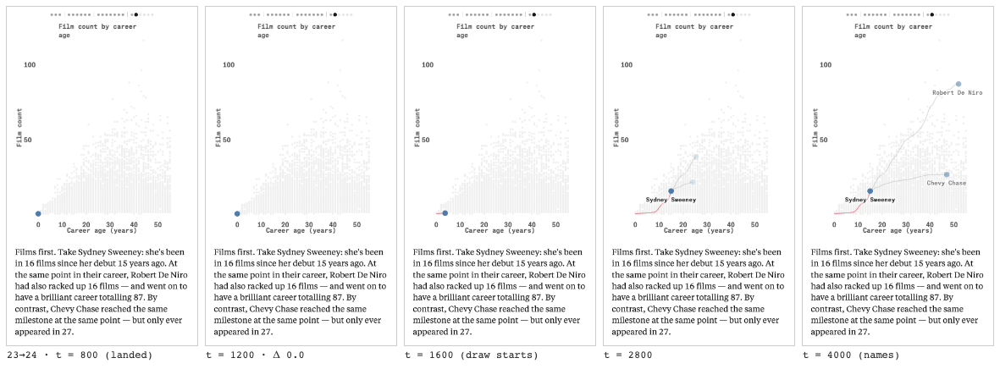

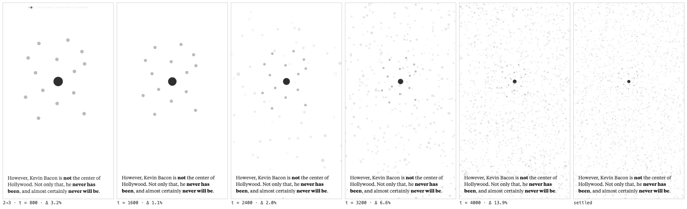

Mechanism: the chained leg and the ambient both fire on the arrival's settle,
which is the 700 ms tween plus the 525 ms edge lag, on states with no edges
arriving. Chain off the dot tween's end, or give these arrivals the unison
delays `titleGalaxy` already uses.

#### 9. Departing edges ride their dots

Rule 2. `EDGE_LAG_DELAYS` delays every edge group by 525 ms of the 700 ms
tween, fading out as well as in, and a dying edge is drawn to both live
endpoints. A departing link therefore rides its moving dots for three quarters
of the tween. On **1→0** the fourteen hold still but Bacon flies and his fan
follows him at 290–435 ms. Under interruption it is worse: with Next pressed
again at 300 ms the dark route edges linger as a chevron in the middle of the
sky until about 900 ms after the second press, because the lag restarts from
the second press while the dots keep shrinking.

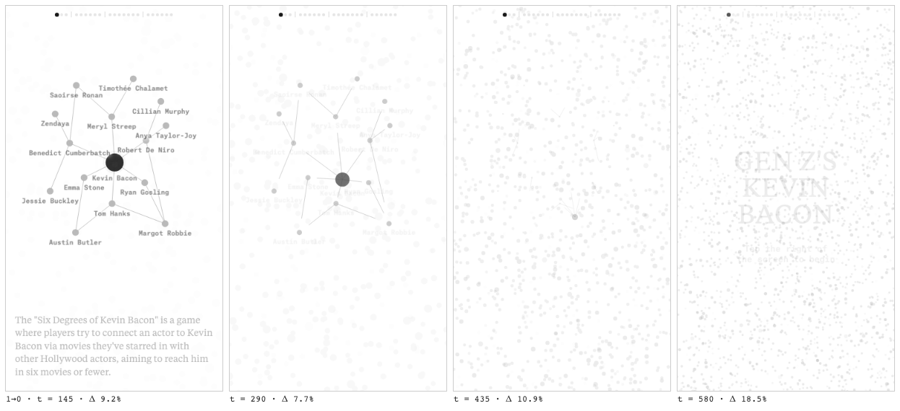

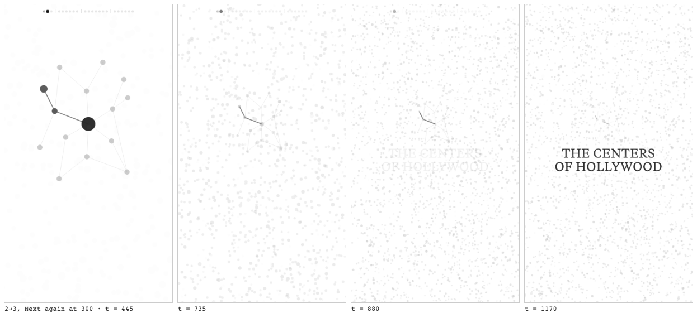

Mechanism: the lag is right for edges fading in and wrong for edges fading
out; a superseding tween should drop the lag for edges already dying.

#### 10. The rank ladder lands on the dissolving chart, then loses rows

Rules 6, 7. Backwards **9→8** the ladder's rows are legible over the race
chart's dots and names at 102 ms and at full by 251 ms, before the chart or
the step-9 prose have left; on mobile rows #8–#11 are then cut at full opacity
between 402 and 601 ms as the panel's box is resized under them. The same row
cut shows on **7→8** and **10→8**, mobile only.

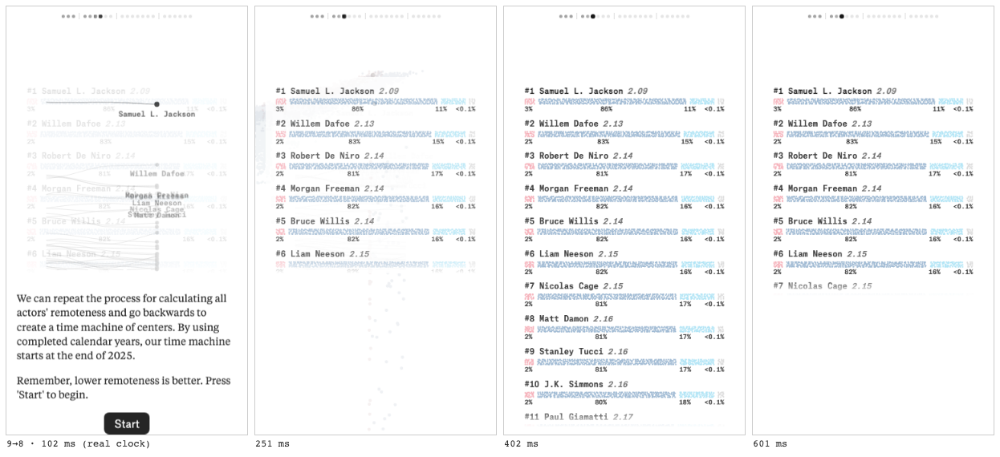

Mechanism: hold the panel's remount until the trails have faded and the prose
has left; size the panel's box before the rows arrive.

#### 11. Names travel with dots in flight

Rule 2. The label layer glues a name to its dot every frame, so a name visible
during a tween captions a dot in the air. Measured across the real-clock runs,
the worst travel while visible:

| Move          | Distance              | Example                  |
| ------------- | --------------------- | ------------------------ |
| 27→28 desktop | 558 px                | "Ariana Greenblatt 9.4%" |
| 11→10 desktop | 428 px                | "Gene Hackman"           |
| 27→26 desktop | 422 px                | "Sydney Sweeney"         |
| 12→11 desktop | 311 px                | "Robert De Niro"         |
| 21→20 mobile  | 25 px on the last leg | the ten revealed pairs   |

On the race chart the ride also makes the stack illegible: names overprint one
another in roughly every second frame of a pan.

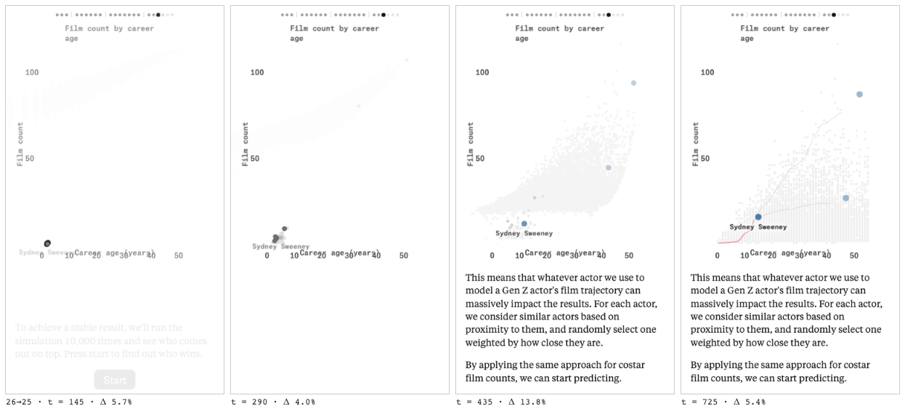

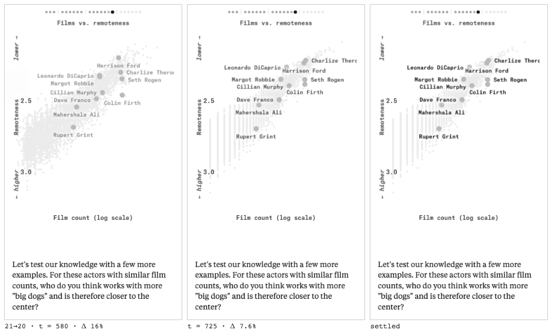

Mechanism: `labelsAfter` on the arrival, or the label's alpha gated on
`story.settled`, for `hopBands`, `careerMany`, `scatterQuiz` and `raceClose`;
run the de-collider against the arriving set only.

#### 12. The crowd sweeps off the canvas, and through the next chart

Rules 1, 6. The career crowd leaves the career chart as a diagonal band that
climbs off the top of the canvas while fading on **25→26**, and re-enters from
the top on **26→25** and **27→25**. On **23↔24** the same crowd sweeps
through the race chart as a dense blob inside the future block. The six
contenders land correctly on the origin.

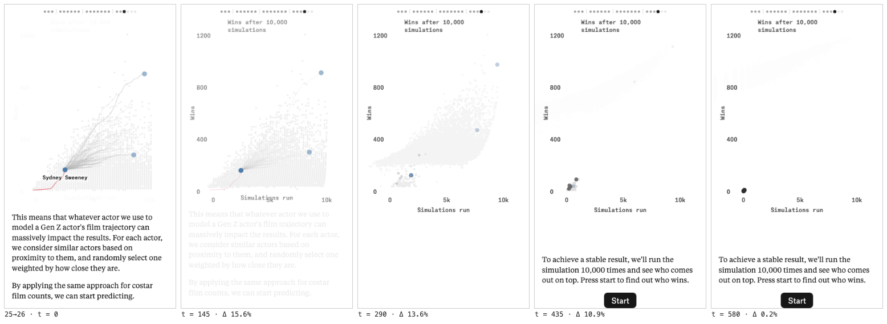

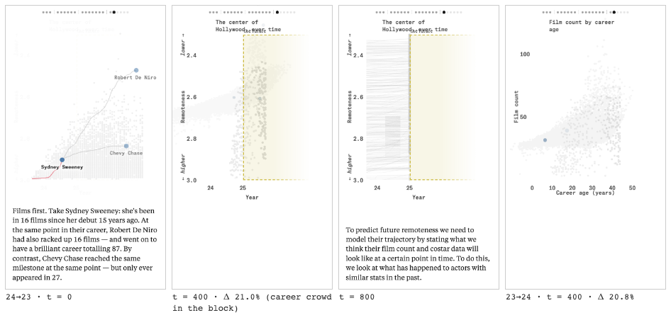

Mechanism: the arriving layout's parked position for the ids it does not draw.
Park them on the previous layout's coordinates at alpha 0 so the crowd fades
where it stands.

#### 13. Step 22 draws the resting camera, then snaps to the pan's start

Rules 5, 7, 10. On **21→22** the chart is drawn at the resting camera for the
first second (ticks 2.4–3.0, about 25 backdrop lines, the dots parked), then
in one frame the window becomes 2.10–2.20 with the dense race cast, then a
3.2 s pan runs back to where it started, landing at about 5.2 s. The real-clock
log catches the tick text and position changing together at 1275 ms. The
"Show Gen Z actors" button is at full ink from 800 ms, about four seconds
before the landing.

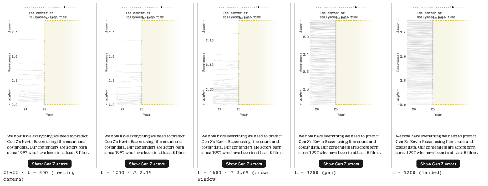

Mechanism: `panDown` does not own the frame until the chained leg starts
(finding 8), so the arrival lands on the static layout and the entry then
starts from the other end. Let the entry own the arrival, and hold the button
on `story.settled`.

#### 14. Stepping into and out of the future strip costs nine to ten seconds

Rules 5, 10. Captured with a 12 s window, both land at about 10.5 s.
**11→12** pans at about 3.1 years per second, reaches the present at 7.4 s,
then opens the block over 2.6 s, with the last change at 10.4 s. **12→11**
closes the block over 2.1 s, leaves a zero-width block still drawing its
dashed border and "the future" label at 2.1 s, starts the pan at 2.6 s and
lands at 10.4 s, the takeover callout arriving at 9.4 s while the pan is still
running. The sentence about the future is read at 0.8 s, about nine seconds
before the future appears. Rule 10 allows a leg over a second only for motion
the reader started; a bare Next and a bare Previous start these.

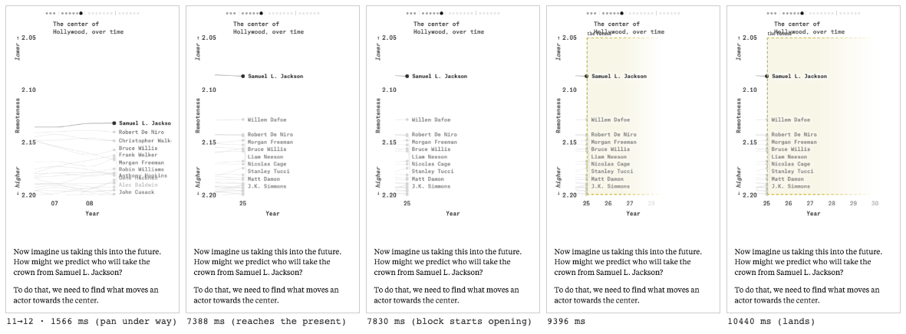

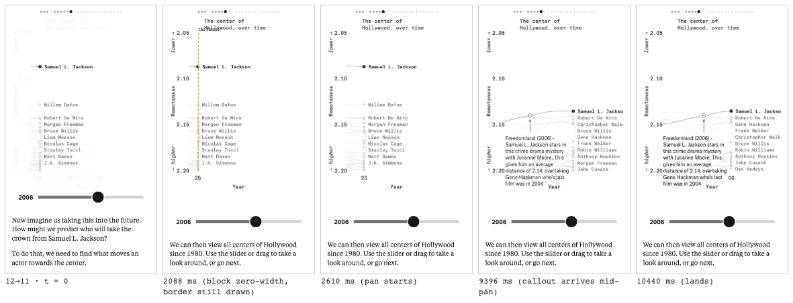

Mechanism: `openFuture` and `closeFuture` run both legs on the step change.
Either the pan waits for a press, or the backward move skips the retrace and
lands as a plain tween.

#### 15. The scrubber reads 2006 for ten seconds while the chart pans from 2025

Rules 2, 5. On **12→11** the year and the slider knob are at full ink from
400 ms, naming 2006, while the axis behind them reads 2025 and pans down for
nine seconds. The control disagrees with the chart by up to nineteen years for
the whole leg.

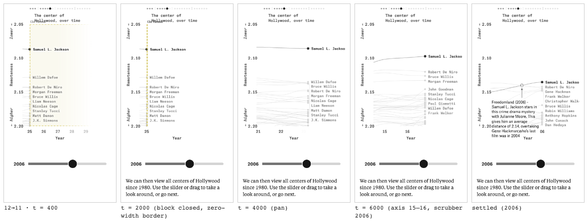

Mechanism: the panel mounts with the step. Gate it on `story.settled`, or read
its year from the live camera during the entry.

#### 16. The prose settles before the canvas does

Rule 6. The prose swap runs on its own clock, out over 200 ms and in by about
560 ms on the real clock, whatever the canvas is doing. It matters most on
**8→9**, where the prose and a live Start button are full at 580 ms and the
six dots then fly for another 700 ms, and on **11→12**, where the sentence
about the future is read about eight seconds before the future appears.

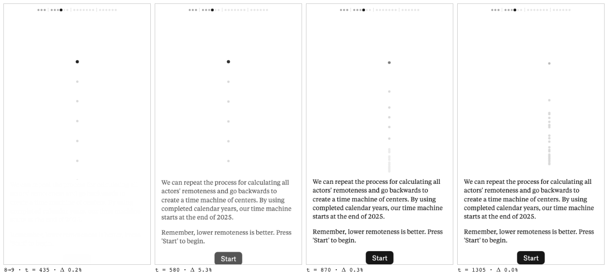

Mechanism: `hold={story.settled !== state}` exists and is used on steps 5 to 8;
the rule says the prose settles last everywhere.

#### 17. Deep links land on states the story never shows

Rules 3, 5. A cold `?step=28` followed by Previous shows step 27 as an empty
simulation under prose naming the winner, because the run never happened in
that session. Step 10 by URL shows 2025 (finding 5).

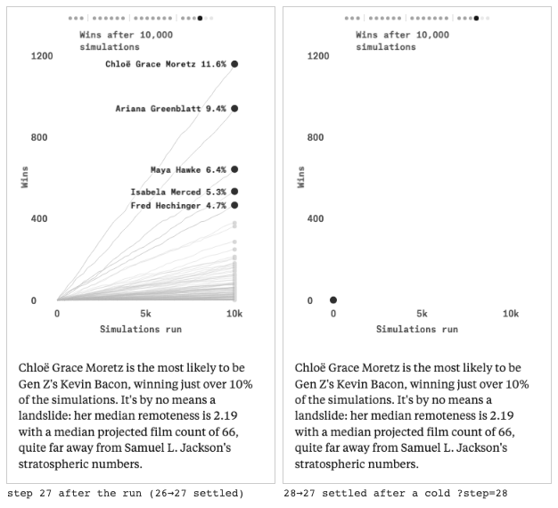

Mechanism: a cold arrival on or past a gated payoff should seed the payoff's
resting result, the way `arrivals.js` already seeds the quiz's revealed state.

#### 18. On the phone the quiz's dim covers the step's own question

Rules 4, 6. On step 20 the blur and dim cover the visual's whole box, and on
the stacked layout the prose card lies inside that box, so the sentence asking
the question is read at about 40% contrast for as long as the reader is
answering. The darkest pixel in the prose card is 150 against 23 on every
other step and on desktop.

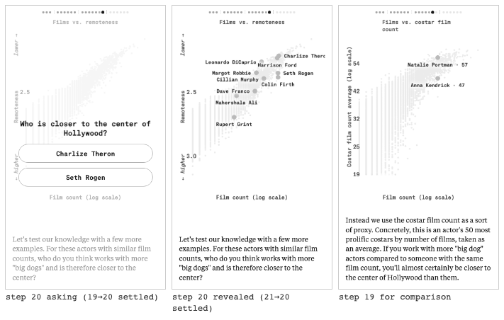

Mechanism: clip the overlay to the plot, above `overlayHeight`, or exclude the
prose card from it.

#### 19. The 8→9 draw-on is dead, then sub-perceptual, then pops a name

Rules 5, 7, 10. After the flight there are 800 ms with six anonymous dots and
a live Start button. The chart's furniture then arrives, and the trails creep
leftward at about 14 px per 400 ms on the phone, which is slower than the eye
reads as motion, ending about 6.6 s after the press on mobile and 7.2 s on
desktop. A tenth name, "J.K. Simmons", appears only when the leg hands over to
the static layout, after everything else is still.

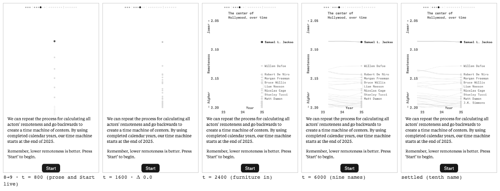

Mechanism: the reveal is chained on the settle (finding 8) and runs a fixed
four seconds whatever span the box shows; a rate in years per second would
make the two boxes agree. The entry's last leg selects a different label set
from the static layout it hands to; make them the same set.

#### 20. The closing chart's draw is 3.6 seconds and its names re-sort four times

Rules 2, 7, 10. On **27→28** the projection draw runs from 1.6 s to 5.2 s on a
bare Next, with all six names riding their dots. Samuel L. Jackson's line
enters from the top at 2.8 s and descends through the stack, which re-sorts at
3.2, 3.6, 4.0 and 4.8 s. On mobile the names are also clipped at the plot's
left edge for the first second, and the 94 unnamed contenders are drawn as a
grey column about 115 px below the plot floor while they travel.

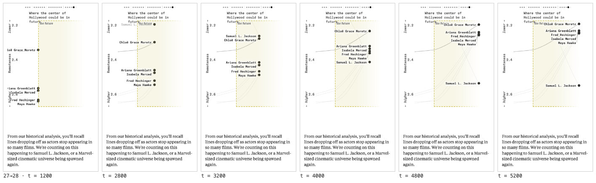

Mechanism: `labelsAfter` for `raceClose`, and either shorten the draw to an
entry's 900 ms or hang it on a press.

#### 21. Phone-width statics

Rule 4. Not motion, but on every mobile frame of the steps concerned:

<!-- cspell:ignore Jackso Therc -->

- "Samuel L. Jackso" clipped at the right edge on steps 9 to 11, and
  "Charlize Therc" on step 20.
- The step 6 prose card overprints the "4 movies away" band label and its dots.
- "the future" collides with the chart title's second line on steps 12, 22
  and 28 (recorded in `prd.md` as P-27-1 for two of them).
- Step 25's x-axis title overprints its own tick labels ("10Care20 age30year40").
- The takeover callout overprints the 2.20 tick and the year row on step 11.
- The step-9 x-axis title sits above its own tick labels, then shifts 40 px on
  the press.
- On 26→27 the first staggered name fades in over the "Wins" axis title.

### Low

#### 22. The actor tour starts on a timer and wipes the names it just brought in

Rules 5, 6. On 1→2 the press produces 1.2 s of nothing, then a route lights.
On 3→2 the fourteen names arrive and thirteen are wiped 400 ms later as the
route lights, names fading out while the route fades in.

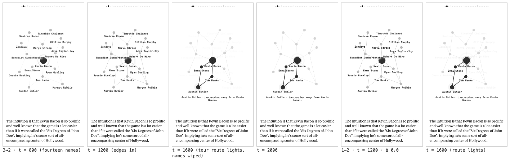

#### 23. The title card's first highlight beat lands with the title

Rules 6, 9. The beat opens at about 0.95 s against a title still fading to
full at 1.0–1.2 s, and its spokes cross "GEN Z'S KEVIN BACON" and the CTA for
four seconds. The card never rests anonymous.

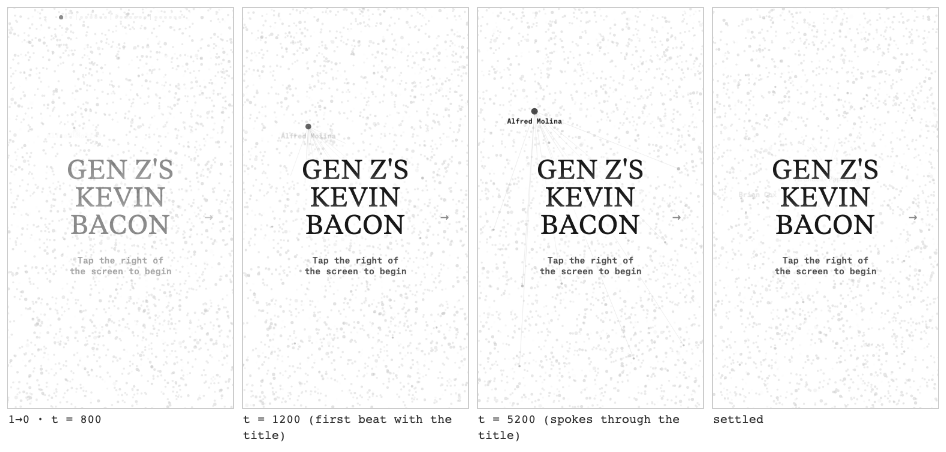

#### 24. Step 3's constellation reads as stuck stars

Rule 9. At rest the fourteen are drawn at the field's grey and size with no
links, holding their pixels while every dot around them streams. `sky.md`
wants foreground; without the links the only thing marking the diagram is that
it is the part not moving.

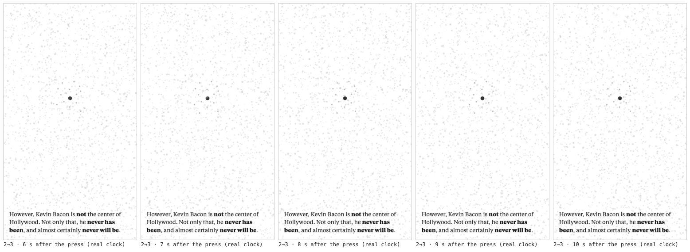

#### 25. Pulse rings are the only non-sky motion at rest

Rule 9. On Bacon at steps 1 and 2 and on Samuel L. Jackson at step 14, and no
design note declares either. Checklist row 1 asks the same question of Bacon's
ring.

#### 26. The dot bar arrives about 0.9 s before the prose

Rule 6. On 0→1, though `title-card.md` says the bar waits for the words
because a bar reports a position the reader has not been given yet.

#### 27. The outro's six dots are alone for 1.6 s

Rule 6. Names gone by 666 ms, the first sky dots at 2.4 s, the crowd at full
density by 4.8 s.

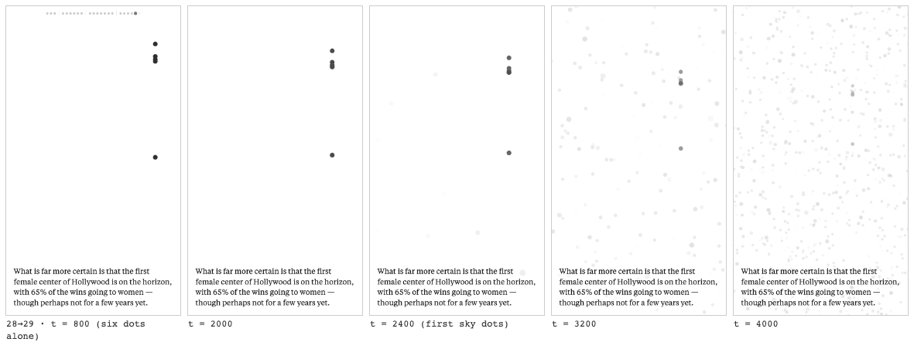

#### 28. The auto-advance steps re-enable their button for one frame

Rules 6, 7. As the run lands the button returns to full ink, then the card
goes blank for a beat before the new prose arrives.

#### 29. Bacon's dot is swapped for the rank row's glyph on 6→7

Rules 6, 7. The swap happens under the panel, and the neighbour rows then
arrive on a timer after the prose has already landed.

#### 30. The band arrival has two dead stretches

Rules 6, 10. On 7→6 the dots land at 800 ms, the labels arrive at 2000 and the
prose at 2800. On 4→5 the press-to-sentence time is 3.6 s.

#### 31. Route edges outlast the grey ones on 2→3

Rule 2. The route is dark at 290 ms while the rest of the constellation is at
a third: two fade rates on one departure.

#### 32. Motion on a timer after landing, collected for one decision

Rule 5. The tour on step 2, the neighbour rows on step 7, the draw-on after
8→9, the trio and fan after 23→24 and 24→25, the fan replaying on the back
arrivals 26→25 and 27→25, and the pans in finding 14. This is motion.md's own
`cardAfter` question, and one answer settles all of them.

## Systemic patterns

Most of the findings are five framework gaps, each visible on many moves:

1. **The HTML layer has no sequence.** Furniture is cut on departure and faded
   in during travel (finding 1); panels mount and unmount with no transition
   (3); a label's text is mutated in place (4); the scrubber and callout mount
   with the step (13, 15). One gate, the one `labelsAfter` already implements,
   applied to the whole overlay, fixes them together.
2. **The "out" beat exists only for trails with a zero target.** Edges lag out
   (9), trails with a live target morph (2), furniture is cut (1). A departure
   fade before the dot tween is the missing half.
3. **Everything chained waits out the edge lag** on states with no edges,
   which produces the dead half-second before every draw-on, pan, pull-back and
   sky (8, and the freeze half of 7).
4. **A cold arrival is not a warm one** (5, 17).
5. **The column swap lands with the press, not with the card** (6).

## What could not be judged

- **Whether the 8→9 creep is perceptible at all** on a real phone, and frame
  rate generally: these are device questions, not frame questions.
- **Why the desktop card arrival differs from the phone** (finding 7): the
  measurements say it does, not why.
- **A one-frame grey dot on 4→3 mobile** at about 400 ms, present at the same
  time in two independent runs.

## Tooling

Three things about the harness, so the next audit starts where this one ended:

- **Sheet against a static build.** Every arrow-key run against a dev server
  in this checkout was refused, because any other server or build regenerating
  `.svelte-kit/` reloads the page mid-run.
- **The faked clock mis-times the HTML layer.** Under it the cold load showed
  axis text faint or missing, Bacon at full ink above the chapter title on the
  desktop card, a scrubber on step 10, a ghost ladder behind the race chart,
  step 20 painted as the previous scatter, and a title at a third opacity at
  the press. None of these exist on the real clock, and two apparent findings
  from the second pass (a 1.2 s prose hold on no-op steps, a 2 s blank card on
  9→8) are simply the faked clock running the fades late: the real numbers are
  560 ms and 646 ms, both correct.

  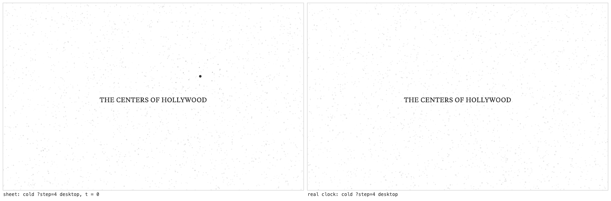

  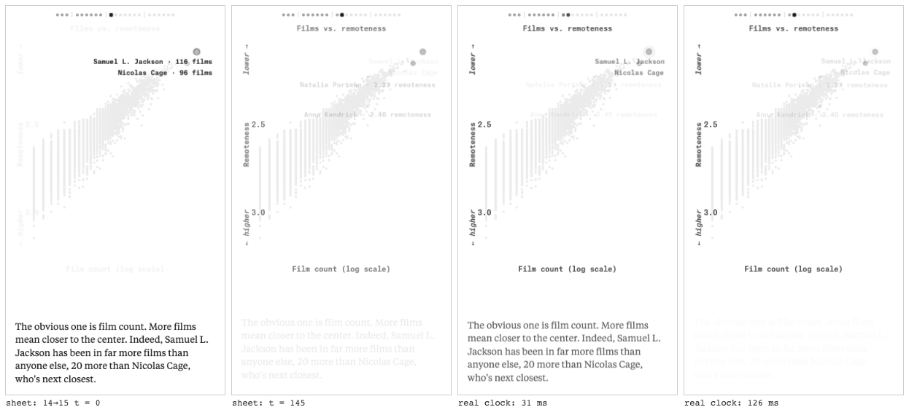

- **A gated step can be left by answering it.** The quiz needed no dev
  setting: clicking a card and waiting out the flight and hold, five times,
  opens the gate and captures the arrival the way a reader reaches it. The
  same trick would cover any future gate.

- **A real-clock mode is worth building into `npm run sheet`.** The third pass
  used about 120 lines on top of the existing script: no `clock.install`,
  screenshots as fast as the browser allows for the first 1.6 s and then one a
  second to ten seconds, and a per-frame log of every visible text element's
  box, effective opacity and text. The log finds pops, jumps, side changes and
  text swaps by measurement; it is what caught findings 1 and 6, which three
  passes of looking at frames had missed.

## Bells and whistles

The design is deliberately quiet, and the findings say the quiet is mostly
broken by things arriving early rather than by too little happening. So these
are about one conductor, not more effects.

- **One sequence for every step change: out, travel, in.** About 200 ms of
  text and trail out, 700 ms of dots, 300 ms of furniture and names in, prose
  last. It is rule 6 as already written, and it fixes findings 1, 2, 8, 9, 11,
  13, 15 and 16 in one place instead of per state. A step change would take
  about 1.2 s instead of 0.7 s, and the reader would have one thing to look at
  at a time.
- **Let a changing label crossfade** (finding 4): old string out, new string
  in, same spot. On 16→17 that crossfade is the whole beat, and it should read
  as the number changing, which is the sentence's point.
- **Hand the flight through a card arrival** (finding 7) so the sky never
  stops and never re-deals. The phone is the authored box, and this is the one
  move where it is worse than the desktop.
- **Answer the quiz with the dots.** The panel already flies the chosen card
  onto its dot; arrive the same way, fading the panel up over the blur once
  the scatter has re-plotted.
- **Land backwards where the words say** (findings 5, 17): step 10 on 2006,
  step 27 on the finished run.
- **Decide the timer question once** (finding 32). One decision,
  recorded in each chart's design note, would let the checklist's rule 5
  column be signed.
- **The one bold moment is already there.** The 0→1 approach is the story's
  memorable motion and it reads as authored. Nothing here adds a second one;
  these remove noise around it.

## Open questions for Owen

- Is a chart line that survives into the next chart ever "the same line" to
  the reader (the shared slot on 27→28)? If yes, the race note should say
  which moves, and every other trail change fades.
- Is step 3's constellation foreground or crowd? `sky.md` says foreground;
  drawn at the field's grey and size with no links, it reads as the part of
  the sky that is stuck.
- Should the column swap on a chapter card wait for the departing prose to
  finish leaving (finding 6), or should the departing prose be pinned to its
  old side?
- Should the seven Gen Z names ride their dots for the three-second arrival on
  22→23, as they do now, or wait at the right edge?
- The pulse rings on Bacon and on Samuel L. Jackson: target lock or noise?
- `cardAfter` versus rule 5, as motion.md already asks, now with the full list
  of moves it decides.
